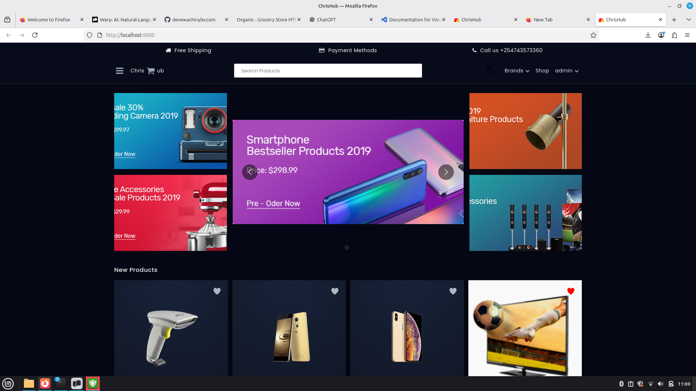
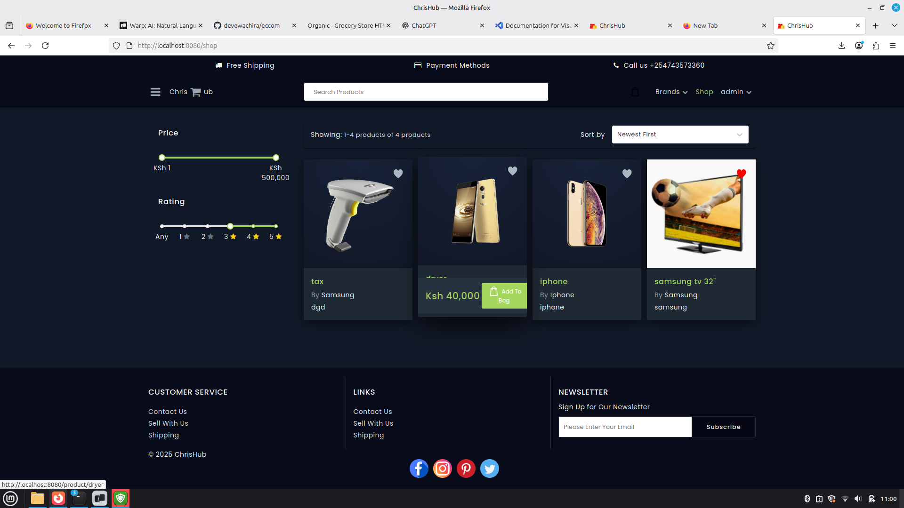
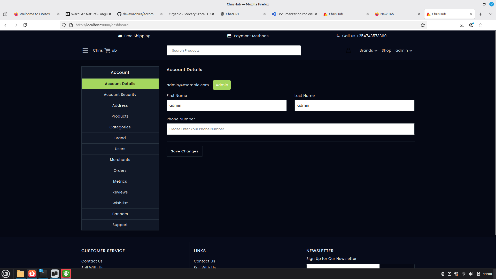
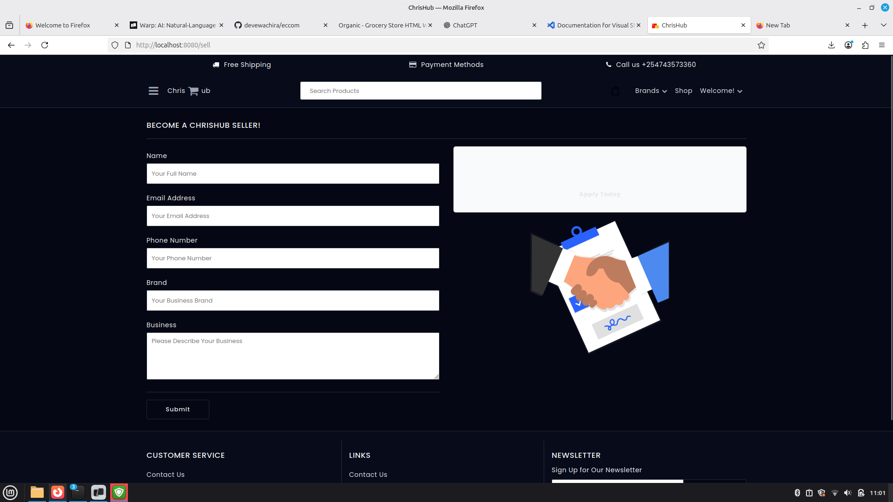
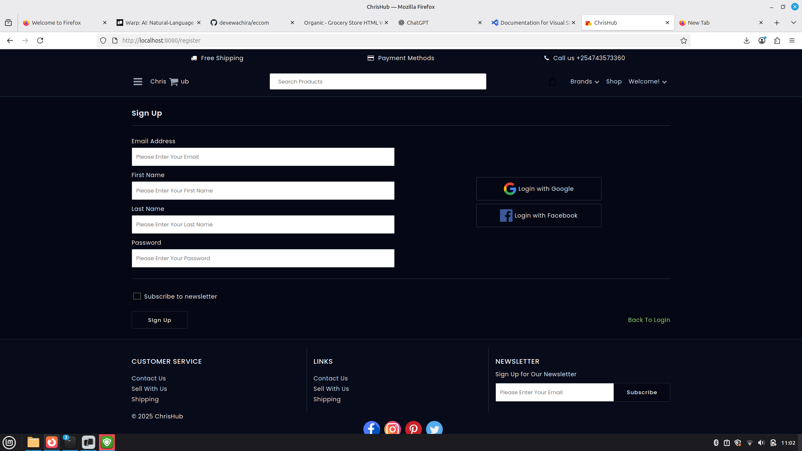

# ChrisHub Ecommerce

> A full‑stack MERN ecommerce platform with multi‑role support (Admin, Merchant, Customer), advanced product management, and a custom dark UI.

---

## Screenshots

Click any screenshot to open it at full size.

[](img/1.png)
[](img/2.png)
[](img/3.png)
[](img/4.png)
[](img/5.png)

---

## Table of Contents

- [Overview](#overview)
- [Key Features](#key-features)
- [Architecture](#architecture)
- [Getting Started](#getting-started)
  - [Prerequisites](#prerequisites)
  - [Environment Variables](#environment-variables)
  - [Installation](#installation)
  - [Running the App](#running-the-app)
- [Admin, Merchant & Customer Flows](#admin-merchant--customer-flows)
- [Metrics / KPI Dashboard](#metrics--kpi-dashboard)
- [Docker Setup](#docker-setup)
- [Database Seed](#database-seed)
- [Tech Stack](#tech-stack)
- [Code Style](#code-style)

---

## Overview

ChrisHub is a MERN‑based ecommerce application customized for the Kenyan market (KSh pricing) with:

- A **public storefront** (homepage, shop, product pages, cart, checkout).
- A role‑based **admin dashboard** for managing products, brands, banners, orders, users, and more.
- A **metrics dashboard** that surfaces key ecommerce KPIs (revenue, orders, repeat rate, etc.).

The project started from the open‑source `mern-ecommerce` base and has been heavily styled and extended (product cards, banners, price slider up to 500,000 KSh, metrics, etc.).

---

## Key Features

### Storefront

- Product listing with filters:
  - Price slider (1 – 500,000 KSh)
  - Rating filter
  - Category & Brand filters
- Product cards with:
  - Dark theme, hover lift & image zoom
  - Add‑to‑Cart button that appears on hover
  - Wishlist (like/unlike) button
- Product details page with reviews and stock status.
- Shopping cart, checkout flow, order success page.

### Admin Dashboard

- Manage **Products**: CRUD, activation, brand linking, inventory quantity, pricing.
- Manage **Categories & Brands**: activation control (only active brands/categories appear in store).
- Manage **Users & Merchants**.
- Manage **Banners** (homepage promotional images, hero sections).
- View and manage **Orders** & **Reviews**.
- New **Metrics** section with KPI cards (see below).

### Metrics / KPIs (current implementation)

Accessible via **Dashboard → Metrics** for Admins/Merchants.

Backend aggregates data from `Order` and `Cart` collections and exposes:

- **Gross Revenue** – total order value across all orders.
- **Net Revenue** – currently equal to gross (will subtract refunds when refund model is enabled).
- **Total Orders** – number of completed orders.
- **Total Customers** – unique customers who placed at least one order.
- **Average Order Value (AOV)** – revenue / total orders.
- **Repeat Purchase Rate** – % of customers with 2+ orders.
- **Cart Abandonment Rate** – based on number of carts vs. completed orders.
- **Refund / Return Rate** – placeholder (0 for now, to be tied to a Refund model).
- **Conversion Rate** – placeholder (requires traffic analytics such as GA4).
- **Todays Revenue** – revenue from orders created today.
- **Last 7 Days Revenue** – revenue from orders in the last 7 days.

The UI displays these in responsive cards with clear labels and helper text.

---

## Architecture

### Monorepo layout

- `client/` – React + Redux SPA for storefront and dashboards.
- `server/` – Node + Express + MongoDB backend API.
- `docker-compose.yml` – optional containerized setup (client, server, MongoDB).

### Client (React)

- **Entry**: `client/app/index.js`, `client/app/app.js`.
- **Routing & Layout**:
  - `containers/Application` – root container.
  - `containers/Navigation` & `NavigationMenu` – header, nav, responsive menu.
- **Storefront containers**:
  - `Homepage`, `Shop`, `ProductsShop`, `ProductPage`, `Cart`, `OrderPage`, etc.
- **Admin containers**:
  - `Dashboard` (role handling), `Product`, `Category`, `Brand`, `Users`, `Merchant`, `Order`, `Review`, `WishList`, `Banner`, `Metrics`.
- **Common components**:
  - Buttons, tables, inputs, sliders (`RangeSlider`), notifications, etc.
- **Styling**:
  - SCSS under `client/app/styles`, with theme variables in `_variables.scss` and product card styling in `_product.scss`.

### Server (Node/Express)

- **Entry**: `server/index.js` (Express app, middleware, routes, DB connection).
- **Configuration**:
  - `server/config/keys.js` – reads from environment variables.
  - `server/config/passport.js` – JWT + Google/Facebook auth strategies.
- **Models**: `server/models/*.js` – User, Product, Brand, Category, Banner, Cart, Order, Review, Wishlist, etc.
- **Routes** (under `server/routes/api/`):
  - `product.js`, `category.js`, `brand.js`, `order.js`, `cart.js`, `banner.js`, `metrics.js`, etc.
- **Utilities**:
  - `server/utils/queries.js` – store product aggregation queries.
  - `server/utils/store.js` – tax and order calculations.
  - `server/utils/seed.js` – database seeding (admin user).

---

## Getting Started

### Prerequisites

- **Node.js** (>= 14 recommended)
- **npm** (comes with Node)
- **MongoDB**
  - Either local MongoDB instance, or a managed service (e.g. MongoDB Atlas).

### Environment Variables

You need **two** `.env` files: one for `server` and (optionally) one for `client`.

#### Server `.env` (example)

```bash
PORT=3000
MONGO_URI=mongodb://localhost:27017/eccom

# JWT
JWT_SECRET=supersecretdevkey123

# App URLs
BASE_API_URL=http://localhost:3000/api
CLIENT_URL=http://localhost:8080

# Mail providers (optional in local dev)
MAILGUN_KEY=dummy
MAILGUN_DOMAIN=example.com
MAILGUN_EMAIL_SENDER=no-reply@example.com

MAILCHIMP_KEY=dummy
MAILCHIMP_LIST_KEY=dummy

# OAuth (optional for local)
GOOGLE_CLIENT_ID=dummy
GOOGLE_CLIENT_SECRET=dummy
GOOGLE_CALLBACK_URL=http://localhost:3000/api/auth/google/callback

FACEBOOK_CLIENT_ID=dummy
FACEBOOK_CLIENT_SECRET=dummy
FACEBOOK_CALLBACK_URL=http://localhost:3000/api/auth/facebook/callback

# AWS S3 (only if you upload images to S3)
AWS_ACCESS_KEY_ID=dummy
AWS_SECRET_ACCESS_KEY=dummy
AWS_REGION=us-east-1
AWS_BUCKET_NAME=dummy-bucket
```

For more details see the original examples:

- [Frontend ENV example](client/.env.example)
- [Backend ENV example](server/.env.example)

### Installation

From the project root:

```bash
# install root + client + server dependencies
npm install
```

This uses the root `package.json` to run:

- `install:client` → `cd client && npm install`
- `install:server` → `cd server && npm install`

### Running the App

From the **project root**:

```bash
# run client and server together in dev mode
npm run dev
```

Or run each side separately:

```bash
# backend
cd server
npm run dev

# frontend
cd client
npm run dev
```

The client dev server usually runs on `http://localhost:8080` and proxies or talks to the API at `http://localhost:3000/api`.

---

## Admin, Merchant & Customer Flows

### Customer

- Browse categories, brands and products.
- Filter using price range, rating, and search.
- Add items to cart and wishlist.
- Checkout and view order history under **Dashboard → Orders**.

### Merchant

- Manage brands and associated products.
- View orders for their brand(s).
- Update prices, quantities, and product details.

### Admin

- Full control over users, merchants, products, brands, categories and banners.
- Can view all orders and reviews.
- Access the **Metrics** dashboard for KPIs.

---

## Metrics / KPI Dashboard

The Metrics page is accessible from **Dashboard → Metrics** for Admin and Merchant roles.

### Backend

- Implemented in `server/routes/api/metrics.js`.
- Aggregates orders (and carts) to compute:
  - `totalRevenue`, `netRevenue`, `totalOrders`, `totalCustomers`.
  - `averageOrderValue`, `repeatPurchaseRate`.
  - `cartAbandonmentRate`.
  - `todayRevenue`, `last7DaysRevenue`.
- Designed to be extended with:
  - Refund model for accurate `netRevenue` and `refundRate`.
  - Time‑series endpoints for charts (revenue & orders per day).
  - Product‑level stats (top sellers, dead stock, etc.).

### Frontend

- Container: `client/app/containers/Metrics`.
- State: `client/app/containers/Metrics/reducer.js` (wired into `reducers.js`).
- Actions: `client/app/containers/Metrics/actions.js`.
- UI: responsive cards showing the numeric KPIs with short descriptions.

---

## Docker Setup

This project includes a `docker-compose.yml` file for running the stack via Docker (Node API, client, MongoDB).

1. Update environment values inside `docker-compose.yml` (especially `MONGO_URI` and `JWT_SECRET`).
2. Build and start services:

```bash
docker-compose build
docker-compose up
```

This will start the backend, frontend and database containers. Check the logs for exact URLs.

---

## Database Seed

You can seed an **admin user** into the database by running the seed script defined in `server/utils/seed.js`.

```bash
# from project root
npm run seed:db [email-***@****.com] [password-******]
```

Notes:

- Replace the arguments in brackets with your desired admin email and password.
- The seed script connects using `MONGO_URI` from your server `.env`.

---

## Tech Stack

- **Backend**
  - [Node.js](https://nodejs.org/en/) – runtime.
  - [Express](https://expressjs.com/) – web framework.
  - [Mongoose](https://mongoosejs.com/) – MongoDB ODM.
  - Passport (JWT, Google, Facebook) – authentication.

- **Frontend**
  - [React](https://reactjs.org/) – UI library.
  - [Redux](https://redux.js.org/) & `redux-thunk` – state management + async actions.
  - [Reactstrap](https://reactstrap.github.io/) & Bootstrap – layout/components.
  - [Webpack 4](https://webpack.js.org/) – bundler.
  - SCSS – styling with theme variables.

- **Other services (optional)**
  - Mailgun / Mailchimp – transactional emails and mailing lists.
  - AWS S3 – product and banner image storage.

---

## Code Style

Prettier is recommended for consistent formatting.

1. Create `.vscode/settings.json` with:

```json
{
  "editor.formatOnSave": true,
  "prettier.singleQuote": true,
  "prettier.arrowParens": "avoid",
  "prettier.jsxSingleQuote": true,
  "prettier.trailingComma": "none",
  "javascript.preferences.quoteStyle": "single"
}
```

2. Install the **Prettier** VSCode extension.
3. Format on save to keep JS/JSX consistent.

---

If you need additional documentation (e.g. GA4 tracking, ROAS modeling, or more advanced metrics dashboards), those can be added as separate docs under a `docs/` directory.

